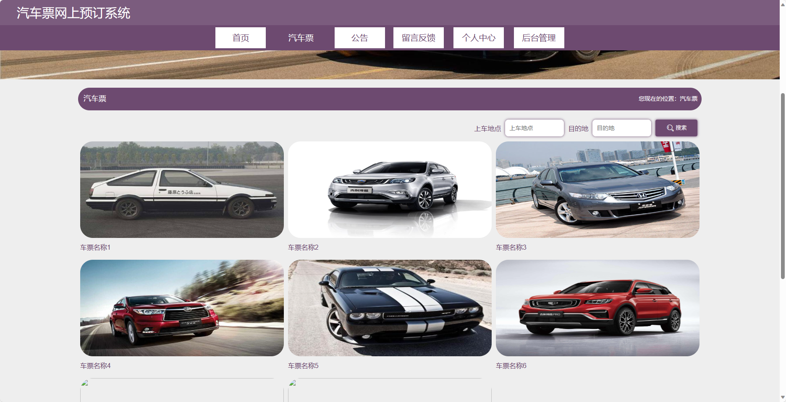
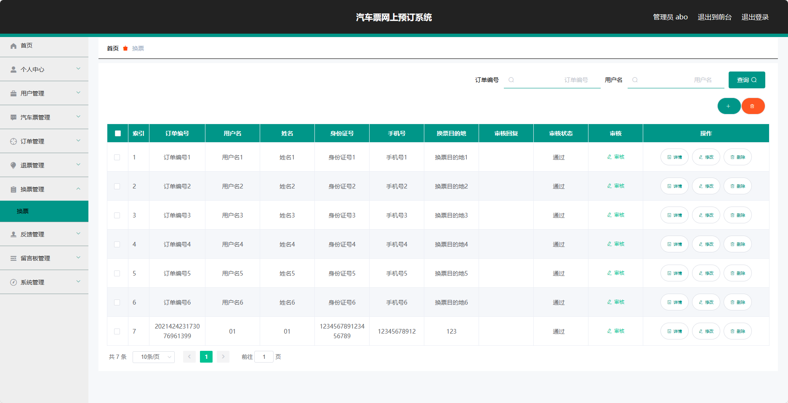
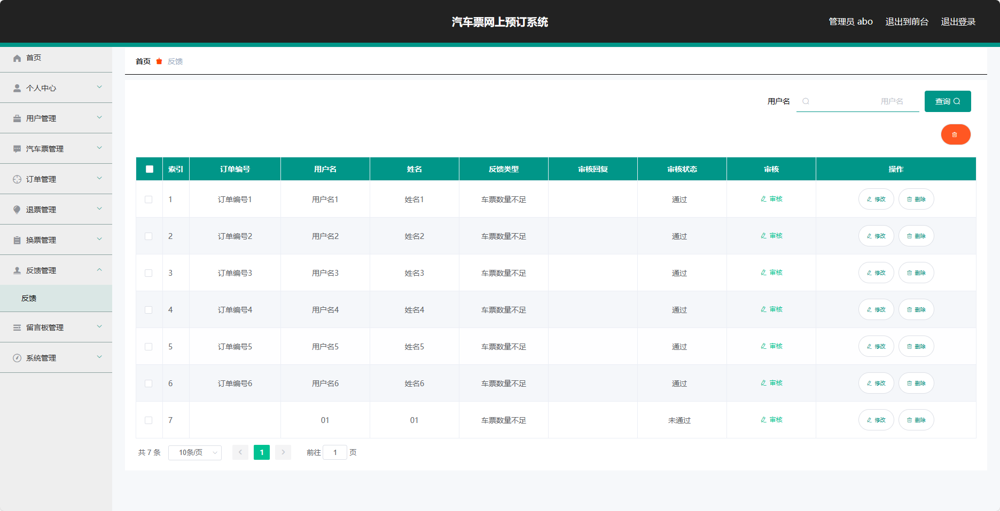

## 基于SpringBoot的汽车票网上预订系统(程序+报告)

###  获取sql数据库文件: 从戎源码网 (https://armycodes.com/) QQ: 386869957 QQ群: 377586148
###  所有系统地址: (https://github.com/YuLin-Coder/AllProjectCatalog) 
###  所有项目以及源代码本人均调试运行无问题 可支持远程安装部署调试、定制修改、代码讲解

## 项目介绍
基于SpringBoot的汽车票网上预订系统，系统包含两种角色：管理员、用户,系统分为前台和后台两大模块，主要功能如下。

### 【管理员】:
1. 用户管理：管理员可以管理网站上的用户信息，包括添加、编辑、删除等操作。
2. 汽车票管理：管理员可以管理网站上的汽车票信息，包括添加、编辑、删除等操作。
3. 订单管理：管理员可以管理网站上的订单信息，包括查看、修改、取消等操作。
4. 退票管理：管理员可以管理网站上的退票申请，包括审核、处理等操作。
5. 换票管理：管理员可以管理网站上的换票申请，包括审核、处理等操作。
6. 反馈管理：管理员可以查看网站上的用户反馈信息，并进行回复等操作。
7. 留言板管理：管理员可以管理网站上的留言板信息，包括查看、删除等操作。
8. 系统管理：管理员可以管理系统的基本配置和权限设置等。

### 【前台】:
1. 首页：展示网站信息、活动公告等。
2. 汽车票：提供汽车票查询、购买、修改订单、退票、换票等功能。
3. 公告：展示网站的新闻资讯、活动公告等。
4. 留言反馈：用户可以留言反馈意见和建议。
5. 个人中心：用户登录后可以查看个人信息、订单记录等。

### 【用户】:
1. 汽车票管理：用户可以查看、购买、修改、退票、换票等自己的汽车票订单信息。
2. 订单管理：用户可以查看自己的订单信息，包括历史订单和当前订单，进行修改、取消、支付等操作。
3. 个人信息：用户可以修改自己的个人信息，包括联系方式、密码等。
4. 反馈管理：用户可以查看自己提交的反馈信息的回复状态。

## 项目技术
- 编程语言：Java
- 数据库：MySQL
- 项目管理工具：Maven
- 前端技术：HTML、CSS、JavaScript、Jquery、Vue
- 后端技术：Spring、SpringMVC、MyBatis

## 运行环境
- JDK版本：JDK1.8及以上
- 开发工具：IDEA、Ecplise、Myecplise都可以
- 数据库: MySQL5.7及以上
- Maven：maven3.0及以上
- Node：14.14.0及以上

## 运行截图

